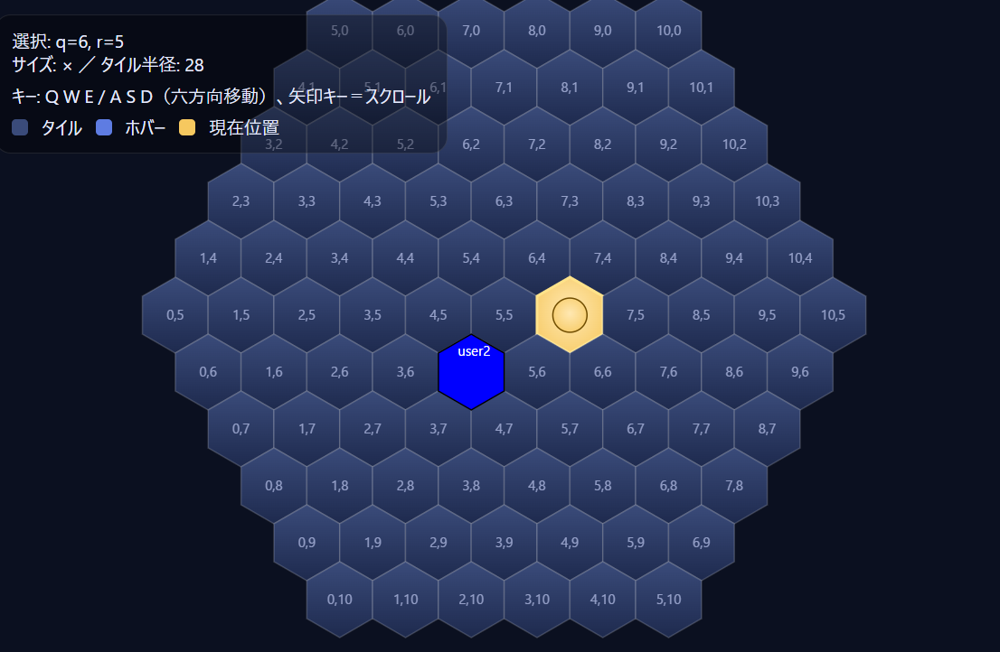

# jinro-hexagon
## どんなものが作りたいか

六角形の盤面・ターン制での人狼ゲーム的な物を作りたい
- 昼のフェーズ・夜のフェーズがあって夜は他の人の動きが見えないみたいなのを想像している
    - 昼のフェーズ・夜のフェーズがそれぞれ何ターンかは要テストプレイ
- 昼に吊るときは普通の将棋みたいな感じのプレイになりそう？投票でもいいけど駒の動きで決定した方が面白そう。
- 駒の動き方や人狼や狩人の能力の適応範囲も色々実装して試してみたい
    - 例：人狼・狩人共に夜のフェーズで一回移動する。そのあと半径位置nマスの範囲で殺したり守ったりできる。狩人は半径2マスで人狼は1マスとかだとちょうどよさそう。
## 起動方法
` docker-compose build `

` docker-compose run --rm app npm install `

` docker-compose up -d `

## 使い方
`localhost:3000`にアクセスしてユーザーidとルームidを入力。
### ファイル
- app/server.js
    - socket.io用のexpressサーバー
- app/hexagon-map/js/hexagon-map.js
    - マップメイン処理
- app/hexagon-map/js/move_restrictions.js
    - プレイヤーの動きを制限
- app/index.html
    - ルーム
- app/hexagon-map/hexagon-map.html
    - ゲームに盤面

## 開発環境
- front
    - vue.js
- server
    - node.js
    - express
- socket
    - socket.io

